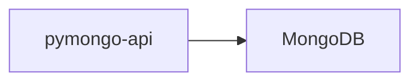
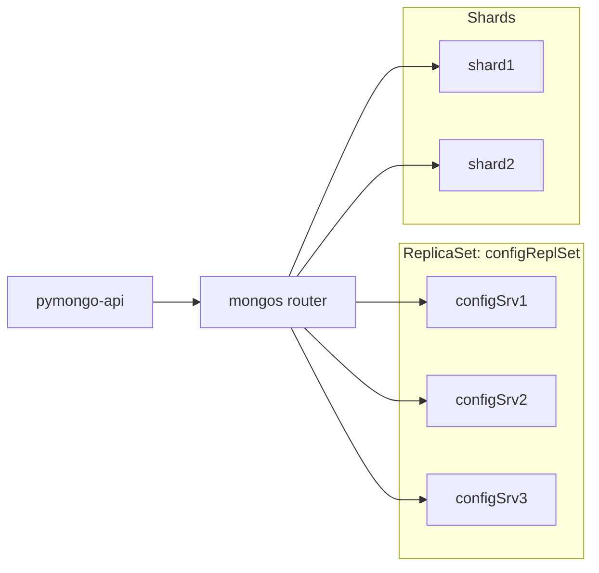
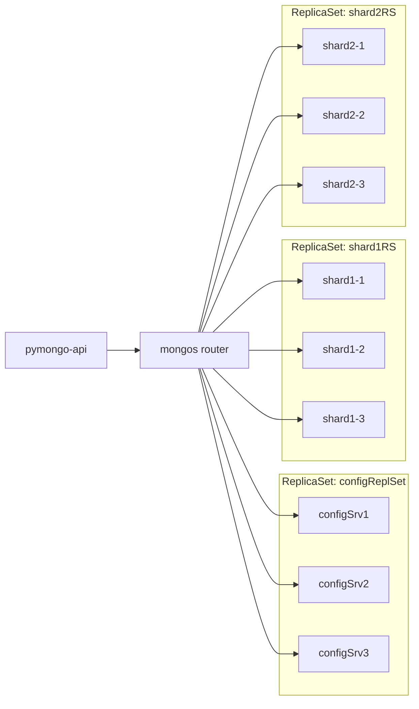
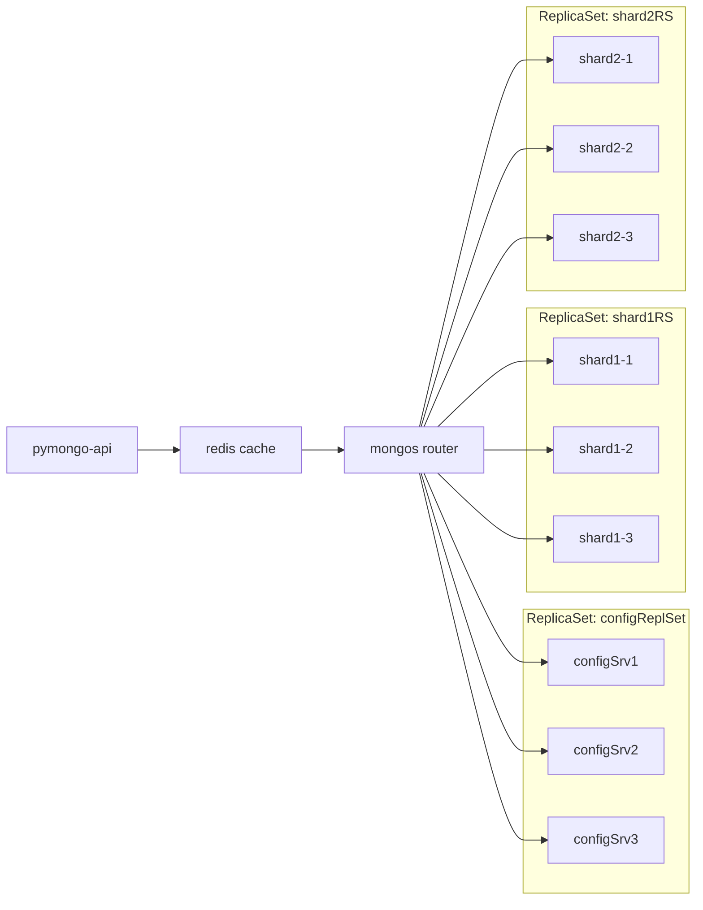
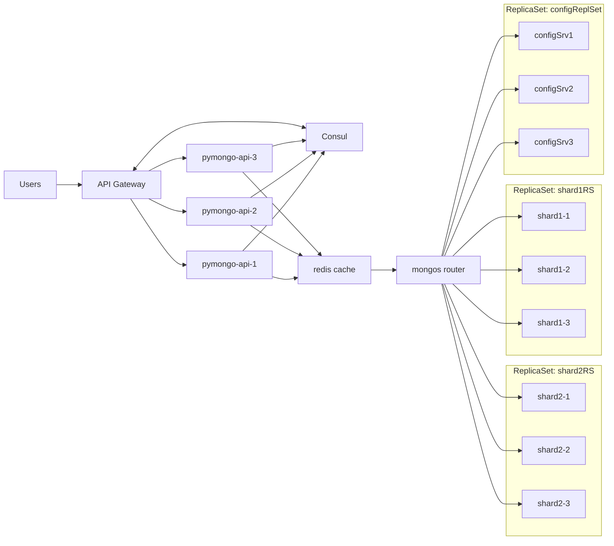
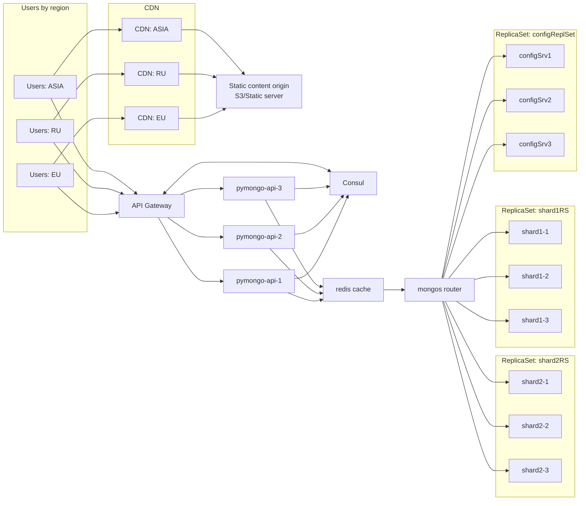

# Задание 1 — планирование (схемы)

Ниже — 5 вариантов схем (по этапам 1–3 и дополнениям из заданий 5–6). Ревьюер обычно проверяет **итоговый** вариант (вариант 5), но промежуточные полезны для контроля изменений.

## Вариант 0 — текущее решение

## Вариант 1 — шардирование (2 шарда)

## Вариант 2 — шардирование + репликация (по 3 реплики на шард)

## Вариант 3 — шардирование + репликация + кеширование (Redis)

## Вариант 4 — добавляем горизонтальное масштабирование + Service Discovery + API Gateway (задание 5)

## Вариант 5 — добавляем CDN для статики (задание 6) — итоговая схема

