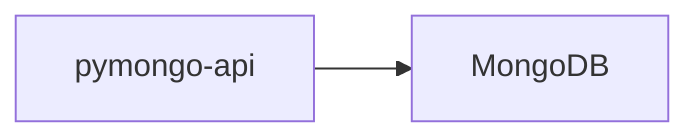

# Сдача проектной работы 4 спринта

## О компании

В этой проектной работе вас ждёт кейс онлайн-магазина «Мобильный мир», где можно купить аксессуары для смартфонов. Уже готов Proof of Concept (PоC) для сайта, чей бэкенд состоит из нескольких микросервисов.

## **Текущее решение**

В преддверии «чёрной пятницы» магазин запустил классную рекламу, которая привлекла много покупателей. Из-за этого в какой-то момент сайт перестал справляться с потоком пользователей и упал на несколько часов.

Чтобы узнать причины сбоя, команда разработчиков провела исследование. Выяснилось, что один из микросервисов — API, который работает с базой данных, — не справился с нагрузкой, что повлияло на работу всего сайта. Забились очереди обработки заказов, таски начали отваливаться по тайм-ауту. В итоге магазин потерял много заказов и упустил прибыль.

На схеме изображён один инстанс приложения и одна нода MongoDB:




Скоро «Мобильный мир» собирается провести ещё одну распродажу. Чтобы подготовиться к ней, команда разработчиков планирует повысить отказоустойчивость приложения и ключевой базы данных, увеличить пропускные способности инфраструктуры и оптимизировать компонент системы, который отвечает за взаимодействие с MongoDB.

Эту задачу вы и будете решать в проектной работе.

## Задание 1. Планирование

Ваша задача — реализовать шардирование, репликацию и кеширование. Чтобы это сделать, распланируйте изменения.

Вот шаблон схемы исходного приложения:


На основе этого шаблона вам нужно создать схему итогового решения. Рекомендуем работать над ней в несколько этапов. Вот первые три шага:

1.  Подготовьте первый вариант схемы. Изобразите, как вы будете использовать шардирование в MongoDB, чтобы повысить производительность. Двух шардов будет достаточно.
2.  Составьте второй вариант схемы. Изобразите, как будет реализована репликация MongoDB для повышения отказоустойчивости. Чтобы это сделать, скопируйте первый вариант схемы и доработайте его, чтобы для каждого шарда была настроена репликация. На этом этапе у каждого шарда должно быть по три реплики.
3.  И наконец, на третьем варианте схемы изобразите вашу реализацию кеширования, чтобы повысить производительность ещё больше. Чтобы это сделать, скопируйте второй вариант схемы и добавьте инстанс Redis для кеширования запросов приложения к MongoDB

Обратите внимание, что к концу проектной работы у вас всего получится пять схем, потому что в заданиях 5 и 6 тоже нужно будет поработать со схемой. Однако ревьюер будет проверять только итоговый вариант. На нём должны быть все изменения, которые вы внесёте в проект в процессе решения проектной работы целиком. Мы рекомендуем делать отдельные схемы для каждого этапа, чтобы было проще контролировать изменения.

### **На что будет смотреть ревьюер:**

-   На схемах укажите инстанс приложения и все инстансы инфраструктурных сервисов, а также их типы (`pymongo-api`, `configSrv`, `redis`, `shard1-1`, `shard1-2` и т. п.). Имена сервисов можно взять из примеров, которые описаны в уроках.
-   Выделите группы репликации.
-   Отобразите стрелками сетевые взаимодействия между сервисами.

## Задание 2. Шардирование

1.  Скопируйте исходную директорию с приложением и `compose.yaml` под новым именем `mongo-sharding`.
2.  В файле `compose.yaml` измените имя проекта на `name: mongo-sharding`.
3.  Модифицируйте `compose.yaml` таким образом, чтобы реализовать первый вариант схемы. За основу можете взять пример из урока про шардирование.
4.  В директории с проектом создайте файл `README.md`. Опишите там шаги для инициализации шардирования в MongoDB.

С помощью этого shell-скрипта можно автоматизировать выполнение команд на инстансах MongoDB:

```
docker compose exec -T <service-name> mongosh --port <mongo port> --quiet <<EOF
<mongosh commands here>
EOF  
```

Например, так выглядят команды для отображения количества документов в БД:

```
somedb 
```

инстанса

```
shard1 
```

:

```
docker compose exec -T shadr1 mongosh --port 27018 --quiet <<EOF
use somedb
db.helloDoc.countDocuments()
EOF  
```

Номера портов по умолчанию для различных типов инстансов MongoDB можно узнать [в документации](https://www.mongodb.com/docs/manual/reference/default-mongodb-port/).

5.  Назовите БД `somedb`, а коллекцию — `helloDoc`.

### **На что будет смотреть ревьюер:**

-   Проект запускается.
-   Настройка по инструкции в `README.md` выполняется без ошибок.
-   Приложение работает и показывает общее количество документов в базе (`≥ 1000`), а также количество документов в каждом из шардов.

## Задание 3. Репликация

1.  Скопируйте директорию с проектом `mongo-sharding` под новым именем `mongo-sharding-repl`.
2.  В файле `compose.yaml` измените имя проекта на `name: mongo-sharding-repl`.
3.  Модифицируйте `compose.yaml` таким образом, чтобы реализовать второй вариант схемы. За основу можете взять пример из урока про репликацию и кеширование.
4.  В директории с проектом создайте файл `README.md`. Опишите там шаги, которые нужно выполнить, чтобы настроить репликацию для каждого шарда в MongoDB.
    
    Не забывайте, что с помощью shell-скрипта можно автоматизировать выполнение команд.
    

### **На что будет смотреть ревьюер:**

-   Проект запускается.
-   Настройка по инструкции в `README.md` выполняется без ошибок.
-   Приложение работает и показывает общее количество документов в базе (`≥ 1000`), количество документов в каждом из шардов, а также количество реплик.

## Задание 4. Кеширование

1.  Скопируйте директорию с проектом `mongo-sharding-repl` под новым именем `sharding-repl-cache`.
2.  В файле `compose.yaml` измените имя проекта на `name: sharding-repl-cache`.
3.  Модифицируйте `compose.yaml` таким образом, чтобы реализовать второй вариант схемы. В качестве ориентира можете использовать пример из урока про кеширование.
4.  Чтобы включить кеширование в приложении, добавьте переменную окружения:
    
    ```
    REDIS_URL: "redis://<redis-service-name>:6379" 
    ```
    
    Вместо `<redis-service-name>` напишите имя сервиса redis.
    
5.  В приложении кеширование доступно для эндпоинта `/<collection_name>/users`. Проверьте скорость выполнения повторных запросов — она должна увеличиться.
    

### **На что будет смотреть ревьюер:**

-   Проект запускается.
-   Настройка по инструкции в `README.md` выполняется без ошибок.
-   Приложение работает и показывает общее количество документов в базе (`≥ 1000`), количество документов в каждом из шардов и количество реплик.
-   Второй и последующие вызовы эндпоинта `/<collection_name>/users` выполняются `<100мс`.

## Задание 5. Service Discovery и балансировка с API Gateway

Сейчас у онлайн-магазина «Мобильный мир» развёрнут только один инстанс приложения. Это может вызвать простои в случае перезапуска сайта. Например, при обновлении. К тому же один инстанс может просто не справиться с нагрузкой. Чтобы решить эту проблему, нужно реализовать горизонтальное масштабирование сайта.

Если запустить несколько инстансов, то непонятно, на какой из них подавать трафик. Для распределения трафика используйте API Gateway.

Ещё нужно как-то сообщать API Gateway об изменении количества инстансов. Например, что нужно добавить новые инстансы в балансировку или убрать оттуда удалённые. Чтобы решить эту проблему, используйте Hashicorp Consul для Service Discovery.

Составьте четвёртый вариант схемы, на котором вы покажете реализацию горизонтального масштабирования сайта. Для этого скопируйте третий вариант, добавив на схему API Gateway для балансировки и Consul для Service Discovery.

### **На что будет смотреть ревьюер:**

На схеме нужно отобразить несколько инстансов приложения, инстансы Consul и API Gateway, а также сетевое взаимодействие между ними с помощью стрелок.

## Задание 6. CDN

Чтобы ускорить доставку статического контента пользователям в разных регионах, нужно использовать CDN. Составьте пятый вариант схемы, на котором вы это реализуете. Для этого скопируйте предыдущий (четвёртый) вариант, добавив на него сервис CDN в нескольких регионах.

### **На что будет смотреть ревьюер:**

На схеме нужно отобразить CDN, взаимодействие пользователей из разных регионов с CDN, а также показать, откуда CDN будет получать статический контент онлайн-магазина.

## **Задание 7. Проектирование схем коллекций для шардирования данных**

Онлайн-магазин «Мобильный мир» сильно вырос, и теперь там можно купить не только аксессуары для смартфонов, но также электронику, аудио- и бытовую технику и другие категории товаров. Однако бэкенд сайта всё так же состоит из нескольких микросервисов.

«Мобильный мир» хранит информацию о заказах, товарах и корзинах в трёх коллекциях в MongoDB.

1.  **Коллекция orders включает заказы клиентов и содержит атрибуты:**
    
2.  Уникальный идентификатор заказа;
3.  Идентификатор клиента;
4.  Дату и время оформления заказа;
5.  Список заказанных товаров и их цену;
6.  Статус заказа;
7.  Общую сумму заказа;
8.  Геозону заказа.

_Например, заказ пользователя из Москвы может включать товары из категорий «Электроника» и «Книги»._

Основные операции:

-   Быстрое создание заказов с одновременным списанием остатков.
-   Поиск истории заказов конкретного пользователя.
-   Отображение статуса заказа.
    
-   **Коллекция products хранит сведения о товарах и включает такие атрибуты:**
    
-   Уникальный идентификатор товара;
-   Наименование;
-   Категорию товара;
-   Цену;
-   Остаток товара в каждой геозоне;
-   Дополнительные атрибуты (цвет, размер).

_Например, в Екатеринбурге есть в наличии 50 штук товара «Смартфон X», а в Калининграде — 30._

Основные операции:

-   Частые обновления остатков при покупках.
-   Поиск товаров по категориям и фильтрация по диапазону цен.
-   Описание товара на странице продукта.

3.  **Коллекция carts хранит данные о текущих корзинах (как гостевых, так и пользовательских) и включает атрибуты:**

-   Уникальный идентификатор корзины (_id);
-   Идентификатор пользователя (user_id) и session_id для гостей;
-   Список товаров (items): массив документов { product_id, quantity };
-   Статус корзины (status): "active" | "ordered" | "abandoned";
-   Дату и время создания (created_at);
-   Дату и время последнего обновления (updated_at);
-   Время удаления (TTL) (expires_at) — для автоматической очистки старых корзин.

Основные операции:

-   Создание корзины, когда заходит гость или новый пользователь. Получение текущей корзины по фильтру { session_id, status:"active" } или { user_id, status:"active" }.
-   Добавление или замена товара в корзине.
-   Удаление товара из корзины.
-   Слияние гостевой корзины в пользовательскую, если пользователь залогинится:
    -   прочитать гостевую { session_id, status:"active" };
    -   добавить её items в корзину { user_id, status:"active" };
    -   отметить гостевую как abandoned.
-   Отметка корзины как заказанной.
    

### **Что нужно сделать:**

-   Спроектируйте схемы коллекций products, orders и carts. Проанализируйте представленные атрибуты коллекций и выберите потенциальных кандидатов для шард-ключей.
-   Выберите стратегию шардирования для каждой коллекции, которая обеспечит эффективное распределение данных по шардам.
-   Укажите, почему выбранная стратегия и шард-ключ подходят под особенности коллекций и операций.

### **На что будет смотреть ревьюер:**

Архитектурный документ с описанием, схемами коллекций и примерами команд MongoDB.

## **Задание 8. Выявление и устранение**  «**горячих**»  **шардов**

Из-за категории «Электроника» произошла перегрузка одного из шардов MongoDB, так как 70% запросов приходилось именно на эти товары. Поэтому сейчас нужно разработать стратегию, как выявлять и устранять такие «горячие» шарды, а ещё предложить метрики мониторинга, чтобы в будущем можно было предотвращать такие ситуации. Не забудьте учесть, что товары из популярных категорий могут создавать непропорциональную нагрузку на отдельные узлы.

### Что нужно сделать:

-   Разработайте набор метрик, чтобы отслеживать состояние шардов.
-   Предложите механизмы автоматического перераспределения данных.

### **На что будет смотреть ревьюер:**

Архитектурный документ с предложенными метриками и мерами устранения дисбаланса с примерами команд и настроек MongoDB.

## Задание 9. Настройка чтения с реплик и консистентность

1.  Для коллекций **products** и **orders** и **carts** определите:
    -   Какие операции чтения **могут** использовать secondary реплику для чтения.
    -   Какие операции чтения **должны** читать только с primary.
    -   Укажите, какая **задержка репликации** допустима для операций на secondary.
2.  Обоснуйте выбор, опираясь на:
    -   Требования к консистентности данных.
    -   Частоту обновлений.
    -   Бизнес-логику (например, риск продажи недоступного товара или отображение устаревшего статуса заказа пользователю).

### **На что будет смотреть ревьюер:**

-   Таблица с операциями чтения и указанием, должны ли они идти на primary или secondary.
-   Описание допустимой задержки репликации.
-   Обоснование выбора.

## Задание 10. Миграция на Cassandra: модель данных, стратегии репликации и шардирования

Во время «чёрной пятницы» интернет-магазин использовал MongoDB с **шардированием на основе диапазонов (Range-Based Sharding)**. При резком увеличении нагрузки (50 000 запросов/сек.) возникла **высокая задержка при масштабировании**:

При добавлении новых шардов MongoDB **полностью перераспределяла данные** между всеми узлами, что вызывало **просадку latency** в пик нагрузки, так как система тратила ресурсы на перемещение данных.

Руководство решило перейти на БД Cassandra, чтобы обеспечить:

-   Высокую отказоустойчивость (leaderless‑репликация).
-   Быстрое горизонтальное масштабирование без полного перераспределения данных.
-   Равномерное распределение данных.

## Что нужно сделать

### Задание 10.1

Определите, какие части данных интернет-магазина (например, заказы, товары, корзины, история заказов, пользовательские сессии) являются критически важными с точки зрения целостности и скорости обработки.

Обоснуйте, для каких именно данных применение Cassandra имеет смысл (учтите требования к масштабируемости, геораспределённости, скорости записи/чтения и целостности данных).

### Задание 10.2

Разработайте концептуальную модель для выбранных критически важных сущностей.

Определите partition key и кластерные ключи для каждой сущности, объяснив, как они будут обеспечивать равномерное распределение данных и эффективный доступ в условиях экстремальной нагрузки.

Обоснуйте выбор модели с точки зрения возможных «горячих» партиций и минимизации влияния решардинга при изменении топологии кластера.

### Задание 10.3

Какие стратегии (Hinted Handoff, Read Repair, Anti-Entropy Repair) можно применить для обеспечения целостности данных?

Для каких сущностей вы выберете одну стратегию, а для каких — другую?

Обоснуйте свой выбор с учётом компромиссов между latency запросов и уровнем гарантии согласованности.

### **На что будет смотреть ревьюер:**

-   Архитектурный документ с описанием сущностей и их первичных ключей, выбранных для переноса в Cassandra.
-   Обоснование их выбора с примерами создания этих таблиц в Cassandra.
-   Обоснование выбора стратегий восстановления целостности данных.

# Как сдать работу

**Для заданий 1–6**

Когда решите все задания, создайте пул-реквест в основную ветку. Отредактируйте корневой файл `README.md`. Опишите там, как можно поднять стенд, чтобы ревьюер мог запустить приложение и увидеть все настройки финальной реализации MongoDB.

Репозиторий должен содержать:

1.  Все созданные директории: `mongo-sharding`, `mongo-sharding-repl`, `sharding-repl-cache`. Для проверки будет использоваться директория `sharding-repl-cache`, которая должна включать в себя решение заданий 2, 3 и 4.
2.  Файл `README.md`, где вы описали шаги, которые нужно выполнить ревьюеру, чтобы запустить проект, содержащий приложение, Redis и MongoDB c шардированием и репликацией.
3.  Файл draw.io с итоговой схемой, которая получилась после решения заданий 1, 5 и 6.

**Для заданий 7–10**

Работа сдаётся в виде единого архитектурного документа (например, PDF, Markdown), в котором должны быть отражены:

-   Описание и обоснование архитектурных решений.
-   Структуры данных (схемы коллекций MongoDB, таблиц Cassandra) с указанием ключевых полей и их типов.
-   Выбранные shard-ключи и partition key с кратким пояснением преимуществ и рисков.
-   Минимальные примеры команд или конфигураций (например, команды MongoDB Shell: sh.shardCollection, конфигурация реплик или запросы CQL в Cassandra).
-   Краткие диаграммы или таблицы для иллюстрации структуры кластеров, потоков данных или сравнения вариантов решений.
-   Перечень метрик мониторинга и краткое описание действий при обнаружении проблем с производительностью или консистентностью.

### Перед отправкой проверьте, что

-   В `README.md` проекта есть инструкция, как запустить проект. Обычно достаточно команды запуска проекта `docker compose up -d` и выполнения скрипта. Либо — команды инициализации и наполнения MongoDB.
-   Вы используете docker-образ приложения `kazhem/pymongo_api:1.0.0`.
-   Все сервисы запускаются. Проверить статус сервисов можно командой `docker compose ps`.
-   Приложение открывается в браузере и отображает JSON с информацией о MongoDB.
-   Приложение отображает информацию о MongoDB и статус использования кеша в формате JSON.
